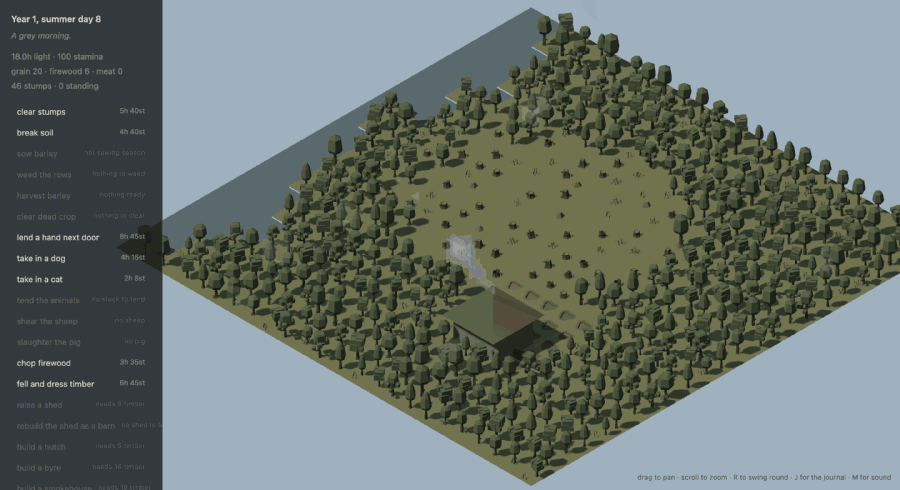
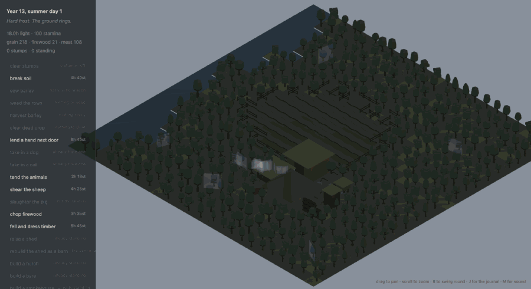
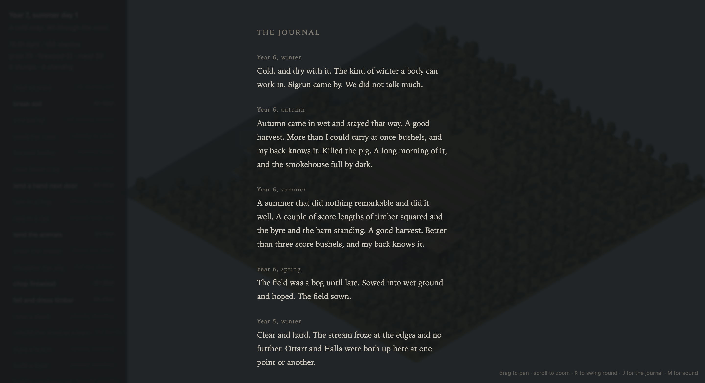
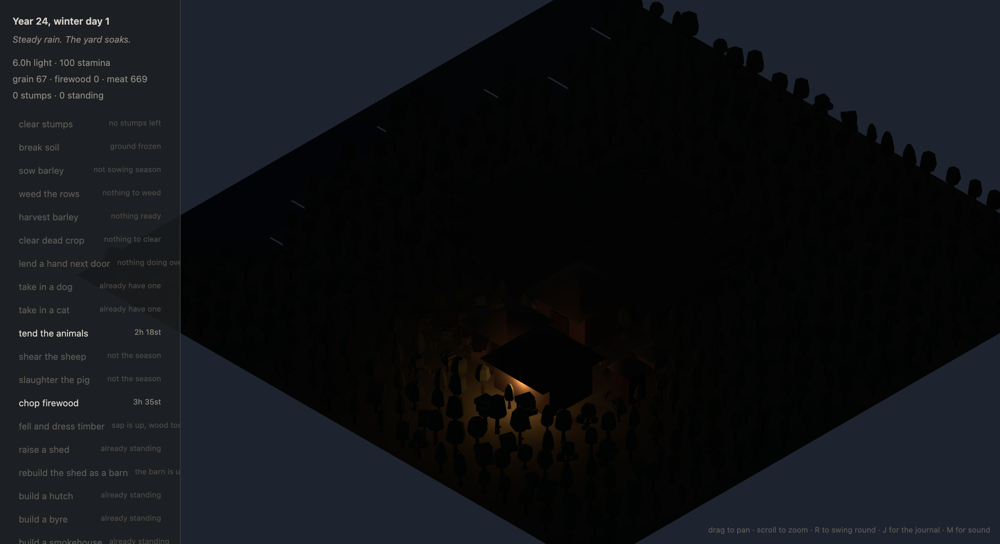

# Stumpland

A quiet farming game. Northern Europe, about 1010 AD.



*Thirteen years on one plot. Stumps come out, fences go up section by section,
the field darkens as the soil comes good, and a barn replaces the shed.
Nothing resets between years.*

You are working a patch of unclaimed forest edge into a farm. Nobody attacks
you, nothing chases you, and you cannot lose. A bad winter means a lean
season, not a game over.

There are no quest markers, no achievement popups and no tutorial voice.
At the end of each season the journal writes three to five sentences about
what actually happened, and keeps every one of them.

```
npm install
npm run dev        # the game
npm run play       # the same simulation, in the terminal
npm test           # 90 tests
```

## The one rule

Simulation and rendering are completely separate.

```
src/sim/       headless. no THREE, no DOM, no window, no fs
src/game/      snapshot.ts + host.ts — the only place the two halves meet
src/renderer/  three.js. reads snapshots, writes nothing back
src/testkit/   automated players, for proving the economy without a human
```

`GameHost` owns the state. Anything that changes the world calls `perform()`;
anything that looks at it gets a `structuredClone` that is deep-frozen in
development, so an accidental write throws instead of quietly corrupting the
save. `tests/architecture.test.ts` greps `src/sim` for `three`, `document`,
`window`, `canvas` and `fs` on every run.

The plot is a 24×24 tile grid owned by the simulation. The renderer only ever
reads it. Swap renderers and the game survives untouched.

## What the simulation does

**Day by day.** Every action costs both stamina and daylight. Daylight runs a
real solar curve at sixty degrees north, and every season boundary is a
solstice or an equinox — spring opens at twelve hours and climbs to eighteen,
autumn falls from twelve to six, winter climbs back. Heat lags the light by
about a week, the way ground and water actually behave. Stamina binds the
summer; daylight binds the winter. That trade is most of why the seasons feel
different.

**Weather is a state, not a dice roll.** Temperature, cloud, precipitation and
wind drift day to day with seasonal bias and multi-day fronts, so a wet week
feels like a wet week. It is described in a line of prose each morning and
never as a forecast. Snow lies and melts unevenly — the wood keeps its drifts
for days after the field is bare. Puddles stand for days and dry slowly.

**Hunting is trap-tending.** You place snares on a forest tile and check them
some days later. Results resolve in a line or two. Empty snares are common and
stated plainly. A roe deer is a genuine event.

**Accumulation is permanent.** Stumps come out and never come back. Fences go
up section by section around ground that has carried a crop. The field darkens
as the soil improves. A shed becomes a barn. A path wears into the grass where
you actually walk — and ploughing erases it, because a turned tile is not a
path any more.

**Animals change what a day looks like.** Hens, rabbits, a goat, sheep, a pig,
and finally an ox who halves the labour of breaking ground. Neglect makes them
thin and unproductive; nothing ever dies of it. A dog improves the snares, a
cat cuts what the store loses to rats. Both age. There is a setting to turn
animal ageing off entirely.



*The solstice at sixty degrees north — eighteen hours of light, and the sun
taking a long shallow arc around the sky rather than passing overhead.*

## Rendering

One `InstancedMesh` per model, about thirty draw calls for the whole plot no
matter how full it gets. Orthographic camera at a true three-quarter pitch;
pan and zoom are clamped and there is no free orbit.

One directional light is the sun, driven by the simulation's solar geometry.
Cloud scales it and softens the shadows. After dark the moon takes over on a
real 29-day cycle: a full midwinter moon rides at fifty degrees and is up all
night, while a full midsummer moon barely scrapes the horizon. A clear winter
night is genuinely workable. Shadows are one cascade at 2048, tight around the
plot. Nothing is baked.



*The journal, read back through the years.*



*A full midwinter moon rides at fifty degrees and is up all night, while the
midwinter sun barely clears six. The hearth throws the only warm light.*

## Controls

| | |
|---|---|
| drag | pan |
| scroll | zoom |
| `R` | swing slowly to the opposite side |
| `J` | the journal |
| `[` `]` | scrub the hour (debug) |
| `M` | sound on and off |
| `Esc` | back to real time |

The renderer accepts debug parameters: `?years=10&day=52&hour=23&cloud=0.1&force=snow`.

## Scripts

```
npm run map -- 10     the plot after ten years, in ASCII
npm run sim           a ten-year economy report for two automated players
npm run shot -- 10     render the current scene headless to a PNG
npm run dist          package with electron-builder
```

## Assets

Kenney Nature Kit 2.1, CC0. See `assets/README.md` for the source and how to
restore it. The livestock are placeholder shapes pending Quaternius' CC0
animal pack — see the same file.

## Sound

Synthesised, not sampled — partly so there is no licence question, mostly
because it answers the weather. The wind bed opens and brightens as the wind
rises, rain comes up through the same filter, snow is duller and quieter, the
stream runs fuller after rain, and the fire only crackles when there is wood
on it. Birds are sparse and only in daylight in the growing seasons. There is
no music and nothing plays because you did something correct.

## Balance

Checked across eight seeds and twelve years, for both an automated diligent
player and one that never farms at all:

| | careless | diligent |
|---|---|---|
| hungry nights in 12 years | 0–1 | 28–51, nearly all in year one |
| cold nights | 0 | 0–2 |
| grain at year twelve | 0–28 | 56–378 |
| tiles ever worked | 0 | 69–74 of a 69–78 tile clearing |

The careless player survives every winter on every seed and never builds
anything. The diligent one has one lean first year and is comfortable after,
and by year twelve has worked essentially the whole clearing — the ox is what
makes the last third of it reachable.

## Packaging

```
npm run dist
```

`electron-builder` is configured for macOS (dmg and zip), Windows (nsis) and
Linux (AppImage). The macOS arm64 bundle has been built and launched — about
277 MB, unsigned, so Gatekeeper will want right-click → Open the first time.
There is no application icon yet.

## Still to do

The Quaternius animal models — the livestock are placeholder shapes. An app
icon. Code signing, if it is ever to leave this machine.
